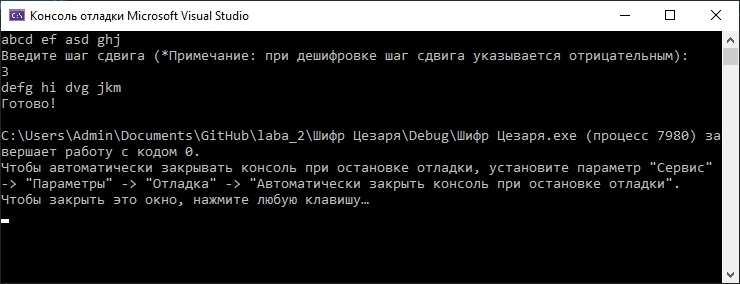

# Шифр Цезаря
Шифр цезаря - один из самых простых и наиболее широко известных методов шифрования.
Шифр Цезаря — это вид шифра подстановки, в котором каждый символ в открытом тексте заменяется символом, находящимся на некотором постоянном числе позиций левее или правее него в алфавите.  
Пример выполнения программы:  
  
Для использования программы сначала введите текст для обработки. Затем, если текст нужно зашифровать, введите шаг сдвига. Если же вы ранее ввели зашифровнный текст, то для расшифровки введите шаг сдвига, предварительно поставив знак минуса.  
Программа реализована на языке С++, написана посредством Microsoft Visual Studio 2019. Для открытия используется файл Шифр Цезаря.sln.
